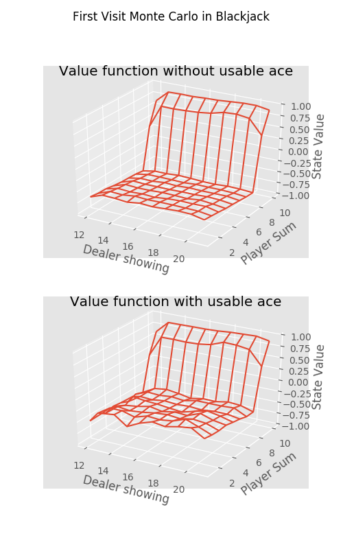
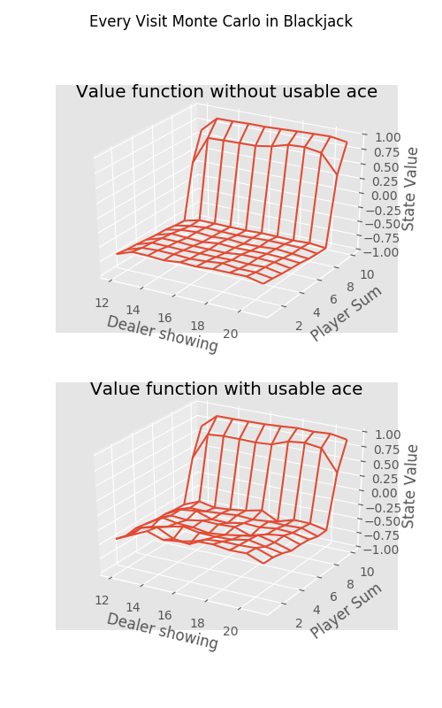
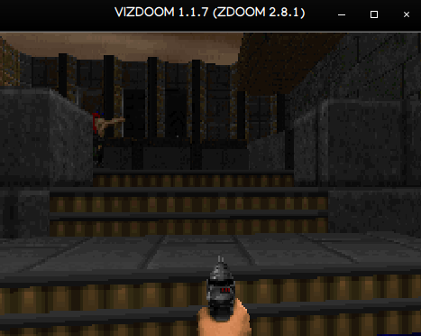
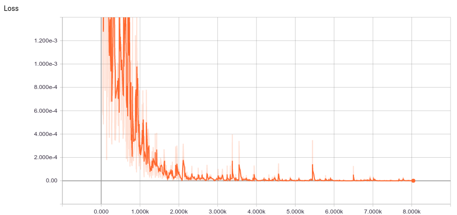

## Learning Reinforcement-Learning
This repo contains some Reinforcement Learning algorithm implementations and tinkering that I did in the summers of 2019.
I used [Tensorflow](https://www.tensorflow.org/) with [OpenAI Gym](https://gym.openai.com/) and [Universe](https://github.com/openai/universe)

### MC methods in Blackjack
Monte Carlo methods in Reinforcement Learning are used where the dynamics and model of the environment are unknown. Hence we do not have any information regarding the transition or reward probabilities. Monte Carlo helps finding the approximate solution through lots of episodes of random sampling. There are two types of MC method: First Visit and Every Visit. Below given are the plots on a Black Jack game for First Visit and Every Visit method. Both usable and non-usable cases are considered.
 
  

### Deep Q-learning on Doom
Implementation of Deep Recurrent Q-Networks on [VizDoom](https://github.com/mwydmuch/ViZDoom). 

<br/ >

Loss after 8000 steps

